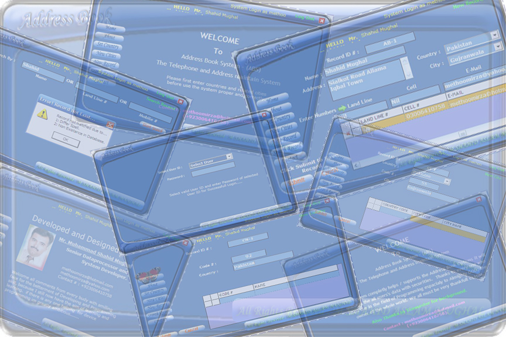

## Address Book Data Base

### Description

its a complete address book that maitain the mobile , landline and email records develope it beccause of lost of my own manual address book so i can't remeber my contact numbers it is very easy 2 use but plz use only enter / return key if u want 2 operate properly don't use mouse at all
 
### More Info
 
please don't forget about cast ur vote. Strongly welcome every one 4 comments and suggestion that i as student need them very much

             |
---                |---
**Submitted On**   |2007-11-25 22:39:06
**By**             |[Shahid Mirza](https://github.com/Planet-Source-Code/PSCIndex/blob/master/ByAuthor/shahid-mirza.md)
**Level**          |Advanced
**User Rating**    |5.0 (10 globes from 2 users)
**Compatibility**  |VB 6\.0, VBA MS Access
**Category**       |[Complete Applications](https://github.com/Planet-Source-Code/PSCIndex/blob/master/ByCategory/complete-applications__1-27.md)
**World**          |[Visual Basic](https://github.com/Planet-Source-Code/PSCIndex/blob/master/ByWorld/visual-basic.md)
**Archive File**   |[Address\_Bo20919311262007\.zip](https://github.com/Planet-Source-Code/shahid-mirza-address-book-data-base__1-69675/archive/master.zip)

